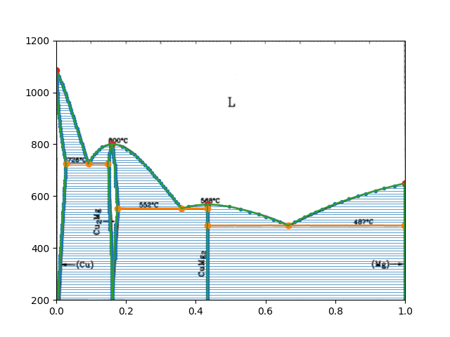
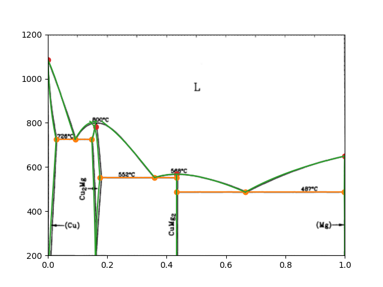

# NFPL800: Termodynamika kondenzovaných soustav

This repository contains a solution for a phase diagram of Cu-Mg mixture done as a part of coursework on thermodynamics.

## Solution

The solution is heavily inspired by
the [Advanced Solution found in this repository](https://gitlab.mff.cuni.cz/svitakda/termodynamika-kondenzovanych-soustav-zapoctovy-program).

However, the calculation approach was slightly different.
The equations are represented as abstract Terms allowing for a symbolic manipulation and greater abstraction of the
mathematical operations.
This comes with some performance penalties due to recursive evaluation;
See [Possible Enhancements](#possible-enhancements).
However, for most calculations the performance is surprisingly good even with the naive implementation.

The code was written with the 'Functional Core & Imperative Shell' approach in mind; therefore, most data structures are
treated as immutable.
In my view, keeping most calculations pure and reducing the mutation of the existing state makes the code more readable
and easier to follow.

## Calculations

The phase diagram is first constructed using a "brute force" method with a ConvexHull of the Gibbs functions.

Next, a more sophisticated approach is used, with the phase diagram being constructed from differential equations, as
derived [in the above-mentioned repository](https://gitlab.mff.cuni.cz/svitakda/termodynamika-kondenzovanych-soustav-zapoctovy-program)

## Possible Enhancements

- Implement a Term substitution, at least for `Param`s (ie. `Param("X")` => `Param("Xfcc")`).
  This would drastically reduce the amount of `.eval` calls in the `calculate_eqline` function.
- Implement a transformation of `Term` to a Python function to remove the recursive evaluation and speed-up
  calculations.
  (e.g. construct a term-string `Sum(Param("x"), Const(2.))` => `"(x + 2)"` and create a function
  using `f = eval("lambda x: (x + 2)")`)
- Write a parser from a given source format to `Term`. (Manual Term construction is tedious.)
- Create a more general Branching/Switching logic for `Term`s, possibly using some generic `Condition` class.
- Create a `PhaseDiagram` class to handle the overall calculation flow in a more structured manner.
